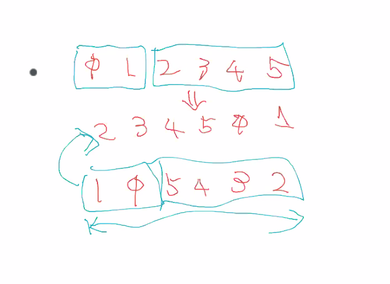

# プログラミング言語Go オンライン読書会#04
2020-09-05 (土)

https://gpl-reading.connpass.com/event/181925/

## 3.6 定数
- 定数同士の計算も、定数となる。
- 大きな数値を格納できる。256bit
- %T: 型

### 3.6.1 iota
iota は累乗演算子ではないので、1000の累乗を生成することはできない。

> - Represent integer constants with at least 256 bits.
> - Represent floating-point constants, including the parts of a complex constant, with a mantissa of at least 256 bits and a signed binary exponent of at least 16 bits.

iota は [APL](https://ja.wikipedia.org/wiki/APL) という言語から来ている。

- KiB ("キビバイト" と呼ぶ): 1024
- KB: 1000

### 3.6.2 型付けなし定数
- untyped の整数・Boolean: 最終的に型が決まっていない。
- 定数同士で演算した結果が 64bit に収まっていれば良い。
- 0, 0.0, 0i などは片付けなし整数。Java だと 0 は int。

## 4.1 配列
配列はサイズも込で型となる。
- crypto/sha256: https://play.golang.org/p/LTA6AgeI3x3
- rune と byte: https://play.golang.org/p/Z8yNYw0Guid
- zero: https://play.golang.org/p/zGIJR8i9gVx

## 4.2 スライス
P95 の図がとても良い。
- スライス演算子 s[i:j] はスライスを返却する。
- cap はスライスの最初から配列の最後までの要素数。(すぐわすれる)
- cap(s) を超えてスライスを作成すると panic
- len(s) を越えてのスライスの作成は、スライスを拡張する。
- reverse: https://play.golang.org/p/zDf0_YK7PeK
- reverse をつかった回転: https://play.golang.org/p/0B2nTPH7wDt


- スライスが自分自身を含む例: https://play.golang.org/p/u1Hard9mVrw
- スライスの比較は nil だけ。
  - 長さ0の配列はそもそも作れるの...?
  - https://play.golang.org
- nil の比較よりは len で長さを見ることが多い。
- 長さ0の配列を underlying array とするスライス: https://play.golang.org/p/nvXopN9ZzwB

### 4.2.1 append
- 拡張ごとに倍にしていく: https://play.golang.org/p/ET1Pn7RlbVC
- x = append(x, x...) 省略記号は何個でも引数を受け付けている。

## 4.3 マップ
- map リテラル
```
ages := map[string]int{
    "alice":   31,
    "charlie": 34,
}
```

- Map を fmt.Print で出力するとキーで昇順ソートされた状態で出力される。(Go1.12 から)
    - https://github.com/golang/go/blob/master/src/fmt/print.go#L769


### ハッシュテーブルの仕組み
N 個テーブルから検索をする:
- 通常: N の 1/2 回: O(N)
- ソートされている: O(log2N)
- ハッシュテーブル: O(1)

M のテーブル:
- Hash int = 2の32乗
- Hash%M
- Hash 値だけを検索すると、index が取れる -> なのでハッシュテーブルは、はやい！
- データはテーブルよりも小さくあるべき。

ハッシュテーブルに対して value を持っている = Map
