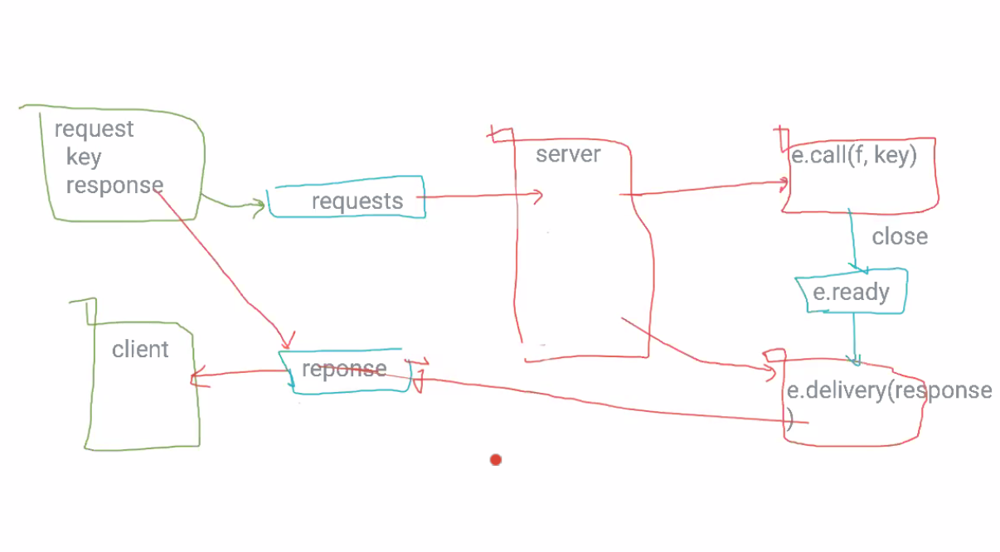

# プログラミング言語Go オンライン読書会#10
2021-04-03 (土)

P311 〜 P312
- RLock と Mutex はどちらが早いかは、実際にベンチマークを取ってみないとワカラナイ。
    - Intel Mac だと、Mutex のほうが早かった。
    - 1つの Read に対してたくさんの書き込みがあるような場合のみ、RLock のほうが早いとか、あるのでは。(考察)
    
```go
func (o *.Once) Do () {
.
.
.
}
```

`1` を書き戻している。

```go
defer atmic.StreUnit32(&o.done, 1)
```



最近は...

10ms 以上処理をし続けているゴルーチンがいると、シグナルを発生させる。
無理やり切り替える。

## 9.8.2 ゴルーチンのスケジュール
### pingpong.go:
`GOMAXPROCS` はデフォルトで 8 で、1 にすると、とても早くなる。
増やすとその分コンテキストスイッチが発生するので遅くなる。

## 9.8.3 GOMAXPROCS
1 と書いたからと言って OS スレッドを 1 つしか使っていない、というわけではない。

## パッケージと Go ツール
今は...
```
$ go
.
.
.
        bug         start a bug report
        build       compile packages and dependencies
        clean       remove object files and cached files
        doc         show documentation for package or symbol
        env         print Go environment information
        fix         update packages to use new APIs
        fmt         gofmt (reformat) package sources
        generate    generate Go files by processing source
        get         add dependencies to current module and install them
        install     compile and install packages and dependencies
        list        list packages or modules
        mod         module maintenance
        run         compile and run Go program
        test        test packages
        tool        run specified go tool
        version     print Go version
        vet         report likely mistakes in packages

```

`go mod vender` を使うこともある。
